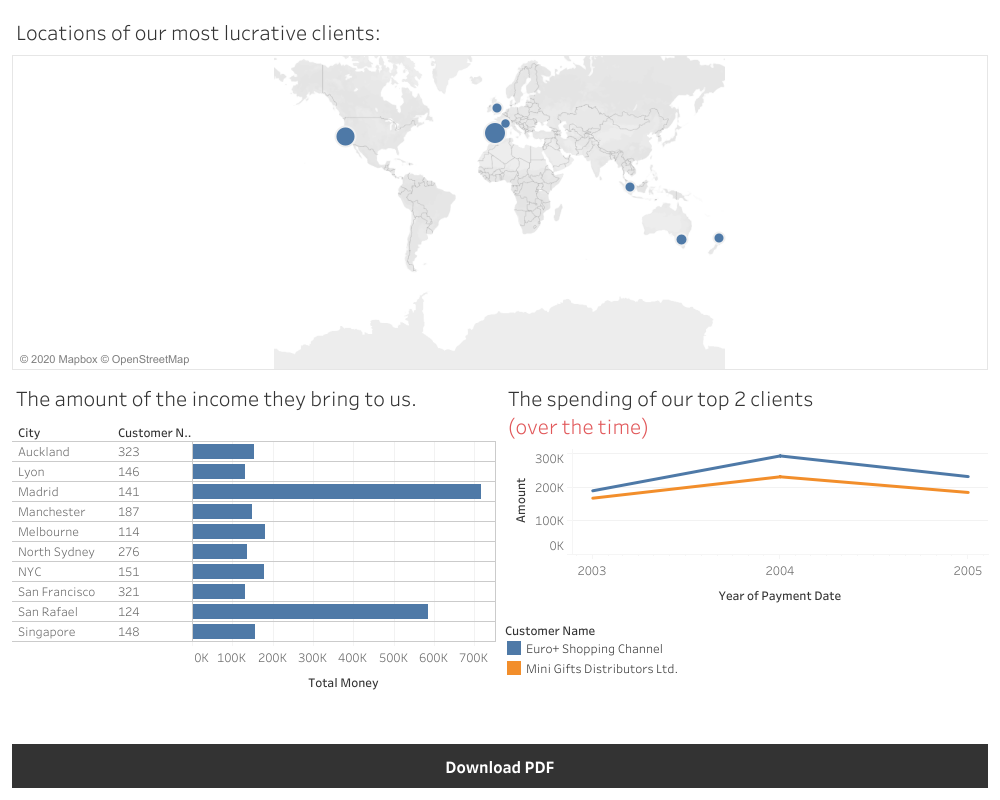
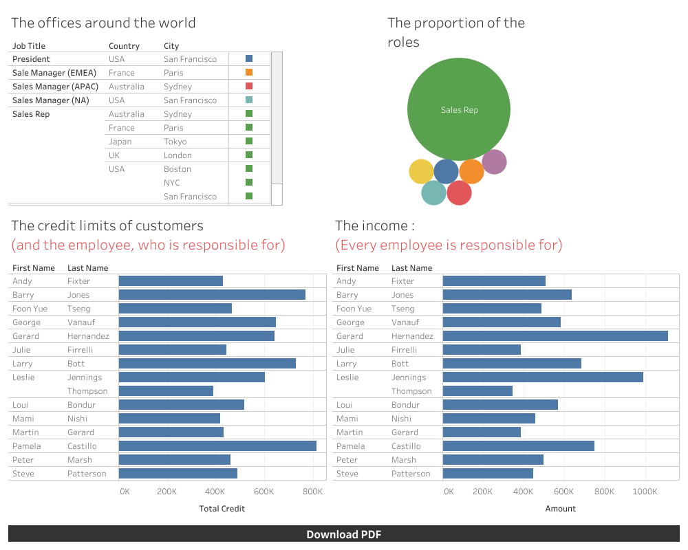

# BI-Analysis-SQL
[the data base](https://www.mysqltutorial.org/mysql-sample-database.aspx/) Also, the files could be seen in the first page of the repository.

# The aims of the project : 
- To extract a meaningful data from a data base of a company. 
- To visualize the results in a dash boards in Tableau.
- To propose a solutions for a difficult business problems, trends , etc. 

Please note that if you acsess the dash boards through the links, you will be able to engage with them more interactively. 

[link](https://dub01.online.tableau.com/t/internshipkpmg123/views/final/Dashboard1?:origin=card_share_link&:embed=n)
This dashboard includes information about the storage of particular important items for the company, their quantity after the last order. Thus, we are able to see which are the most ordered products, for which ones (after an order) we do not have enough quantity in our storage and have to make a loading as soon as possible. For that, reason we have at the end of the dashboard the dates of dispatching for some of the stocks we do not have in the storage. With it, we have information about what we need to charge fast. Also, we have little bonus information, like the description of the three most needed products and the comparisson of the income we would gain from them .

[link](https://dub01.online.tableau.com/t/internshipkpmg123/views/second_dashboard/Dashboard1?:origin=card_share_link&:embed=n)
The next one is dedicated to the customers. Here we have a geographical visualization of our most crucial clients. Their importance is noted in the size of the circles, with which their locations are marked. The bigger it is the more money we recieve from company standing behind it. Also, we have a horizontal bar chart in which we can follow the amount of the sums more closely. This comes to be veri important, as we see very big difference in the amount among the top two clients and everyone else. For that reason, we dedicated a special graph for them, which is a line graph. And in it we could trace the pattern of their spendings to our company over the time.

[link](https://dub01.online.tableau.com/t/internshipkpmg123/views/employees/Dashboard1?:origin=card_share_link&:embed=n)
Finally, we are paying attention to our employees, as the more happier they are the more incomes and good work they will bring to our company. For instance, we have the information of the offices around the world and of course where are the headquarters and where the most crucial positions are located, Next, we have the proportion of the amount of our employees by their role and position in the firm. It's look like we have a lot of Sales Representatives. We could bear this in mind and improve and fix it, as with the information we gain from this analysis one more Marketing Executive would be of help. With so much information, we could invest in more detailed and targeted marketing campaigns. At the end we have two graphs, which on first sight looks similar. However, they are different in meaning. The first one shows how much credit limits has every one of our sales reps gave to the consumers he/she is responsible of. On another hand, the next graph shows how much every single representative have won for our company. We could consider particular bonuses for our most productive employess. As we say in the begining "the more happier they are the more incomes and good work they will bring to our company" .

