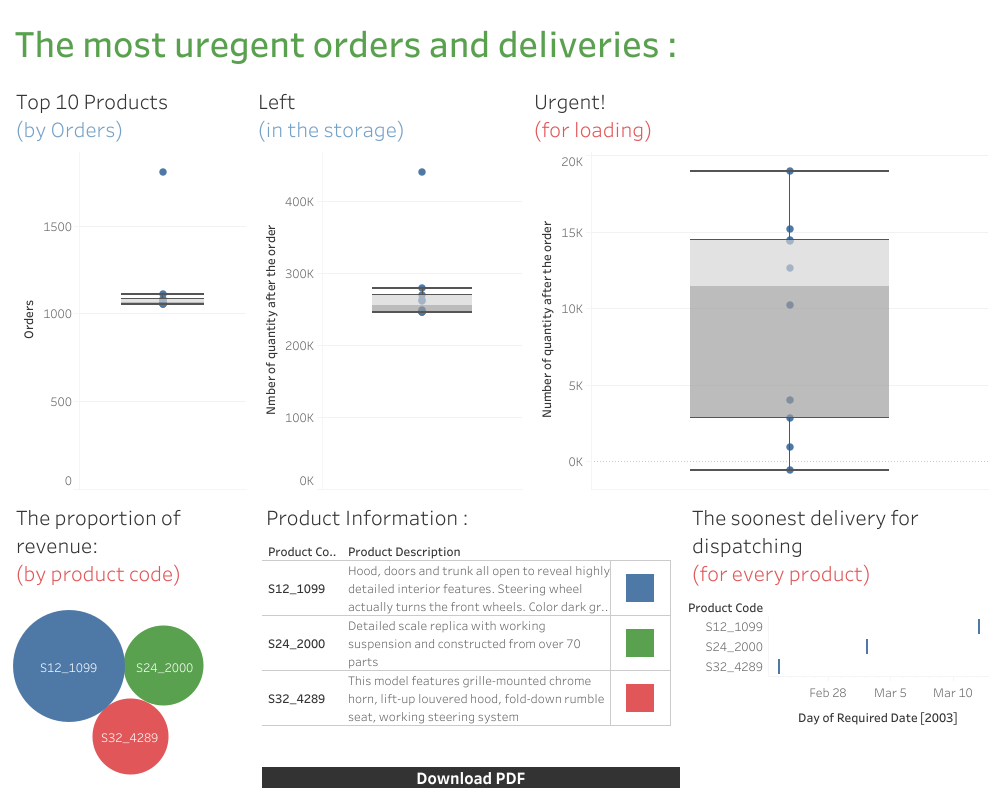

# BI-Analysis-SQL
[the data base](https://www.mysqltutorial.org/mysql-sample-database.aspx/) Also, the files could be seen in the first page of the repository.

# The aims of the project : 
- To extract a meaningful data from a data base of a company. 
- To visualize the results in a dash boards in Tableau.
- To propose a solutions for a difficult business problems, trends , etc. 

Please note that if you acsess the dash boards through the links, you will be able to engage with them more interactively. 

[link](https://dub01.online.tableau.com/t/internshipkpmg123/views/final/Dashboard1?:origin=card_share_link&:embed=n)

This dashboard includes information about the storage of particular important items for the company, their quantity after the last order. Thus, we are able to see which are the most ordered products, for which ones (after an order) we do not have enough quantity in our storage and have to make a loading as soon as possible. For that, reason we have at the end of the dashboard the dates of dispatching for some of the stocks we do not have in the storage. With it, we have information about what we need to charge fast. 
